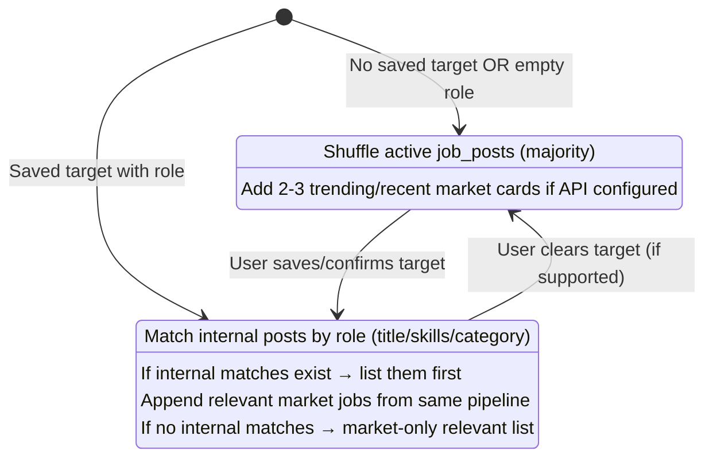

# Home Combined Jobs Feed — Product & Implementation Spec

**Status:** Implemented (phase 1)  
**Last updated:** 2026-05-29  
**Route affected:** `/home` (primary), `/jobs` (redirect), `/jobs/:id/apply` (unchanged)

---

## Problem statement

SkillBridge currently has **two disconnected job experiences**:

| Surface | Route | Data source | Current behavior |
|---------|-------|-------------|------------------|
| Home workspace | `/home` | External market API (`GET /jobs/search` via Jooble) | Drives **skill-gap analysis** and **Requirement matches** — not a browse-and-apply feed |
| Internal board | `/jobs` | Supabase `job_posts` (`status = active`) | Lists **employer posts** only; no target-role search, no recommended/discover feed |

Students expect a **JobStreet-style “Recommended” feed on Home**: browse jobs by default, filter when they set a **Career Target**, and see **employer posts** in the same list as market listings.

---

## Goals

1. Add a **single combined job feed** on `/home` (internal employer posts + external market listings).
2. **Link employer job posts** so new active posts appear in discover and filtered views.
3. **Reuse the existing market job search pipeline** — no second source of truth.
4. **Redirect** `/jobs` → `/home#jobs` (scroll to feed section).
5. Keep **Apply** flow for internal posts at `/jobs/:id/apply`.

---

## Non-goals (phase 1 — do not touch)

These areas stay **unchanged** in phase 1:

- **Analysis content** on Home — diagnostic score, matched/missing skills, Requirement matches, market evidence blocks, refresh controls tied to CV scoring.
- **CV upload** — upload UI, extraction flow, CV review/confirm, and related services.

The combined feed is a **new, separate section** on Home. It may **read** shared state (e.g. `careerTarget`, `jobs` from market search) but must not refactor or restyle analysis components.

---

## Decisions (locked)

### Feed shape

| ID | Decision |
|----|----------|
| F1 | **One combined feed** on Home — internal (`job_posts`) + external (market API), visually unified |
| F2 | **Branded source badges** on each card — e.g. `SkillBridge employer` and provider name (e.g. `Jooble`) |
| F3 | **8–10 cards** shown on Home (medium density) |

### When the feed updates

| ID | Decision |
|----|----------|
| R1 | **Hybrid refresh** — update feed only after the student **saves/confirms** Career Target (role + region), not while editing draft fields |
| R2 | Do **not** trigger feed reload on every keystroke or draft change |

### Ordering & relevance (after target is saved)

| ID | Decision |
|----|----------|
| O1 | Show **matching internal posts first** when any exist for the saved target |
| O2 | Also show **relevant market jobs** when they match the target (not internal-only) |
| O3 | If **no internal matches**, show **market-only**, still relevance-filtered |
| O4 | Market relevance uses the **same pipeline** as today: `searchMarketJobs({ role, region })` — same API/cache as analysis; feed is a **read-only consumer** of that data (no new provider integration in phase 1) |

### Discover mode (before saved target, or empty role)

| ID | Decision |
|----|----------|
| D1 | **Discover shuffle** — feed is not empty on first visit |
| D2 | **Internal-heavy** — majority of cards from shuffled active `job_posts` |
| D3 | **Plus 2–3 market cards** from **trending/recent** results when the job API is configured (lightweight query; exact query TBD in implementation — e.g. broad Malaysia search with shuffle) |

### Primary actions

| Source | Button label | Behavior |
|--------|--------------|----------|
| Internal (`job_posts`) | **Apply** | Navigate to `/jobs/:id/apply` |
| External (market) | **Open listing** | Open `job.url` (or equivalent) in a new tab |

### Routing

| ID | Decision |
|----|----------|
| RT1 | `/jobs` → redirect to `/home#jobs` with scroll into the combined feed section |
| RT2 | Keep `/jobs/:id/apply` for internal applications |

### Standalone Jobs page

The current `JobsPage` (“SkillBridge Jobs” / Internal Board) is **retired as a primary surface** in favor of Home. Logic for listing `job_posts` moves into a shared service used by the Home feed (and optionally a future “load more” if added later).

---

## Open decision (confirm before implementation)

| ID | Question | Recommendation |
|----|----------|----------------|
| Q1 | Fix **“Unknown Company”** on employer cards in the same phase? | **Yes — included** via `attachEmployerProfilesToJobPosts` + `fetchActiveJobPosts` |

---

## UX reference

- **JobStreet “Recommended”** — vertical cards, company, title, location, type, highlights, posted time, primary CTA.
- **Current internal board** — simple card with skills chips and Apply; company name sometimes shows as “Unknown Company” (bug).

### Proposed Home layout (phase 1)

```
/home
├── [Existing] Career target + region (unchanged)
├── [Existing] CV upload block (unchanged — do not touch)
├── [NEW] Jobs for you (#jobs)          ← combined feed
├── [Existing] Analysis / diagnostics   ← do not touch
└── [Existing] Requirement matches ← do not touch
```

Anchor: `id="jobs"` (or `id="jobs-for-you"`) on the new section for `/home#jobs` redirect.

---

## Data sources

### Internal — Supabase `job_posts`

- Filter: `status = eq.active`
- Join: `employer_profiles` for `company_name`, `company_logo_storage_path`
- Fields for card: `id`, `title`, `location`, `employment_type`, `job_type`, `required_skills`, `created_at`, employer display name/logo

**Known issue:** `JobsPage` shows “Unknown Company” when profile join fails (RLS, missing row, or wrong `employer_id` key). Fix during feed work if Q1 = include fix.

### External — existing market pipeline

- Client: `searchMarketJobs({ role, region })` → `GET /jobs/search?role=...&location=...`
- Server: Jooble via `jobSearchCacheFlow` (see ADR 0001)
- Feed uses **same** `jobs` array / search timing as analysis consumer — after hybrid save triggers market load

---

## Feed behavior (state machine)



### Internal match heuristic (implementation detail)

Suggested v1 rules (tune in code + tests):

- Role keyword match against `job_posts.title` (case-insensitive), and/or
- Overlap between saved `careerTarget.role` tokens and `required_skills` / `category`

Keep logic in a pure function (e.g. `buildCombinedJobsFeed.js`) for unit tests.

### Discover shuffle

- Stable shuffle **per session** (seed from session id or `sessionStorage`) to avoid flicker on re-render
- Cap internal pool query (e.g. 20 active posts) then take 5–7 for discover
- Market slice: 2–3 from trending/recent query when `JOB_PROVIDER` configured

### Filtered cap

- Total visible on Home: **8–10** cards after merge/sort
- Optional later: “View more” (not in phase 1 unless scoped)

---

## Merge & sort algorithm (pseudocode)

```
function buildHomeJobsFeed({ mode, careerTarget, internalPosts, marketJobs }) {
  if (mode === 'discover') {
    internal = shuffle(sessionSeed, internalPosts).take(7)
    market = trendingRecent().take(3)
    return interleaveOrAppend(internal, market).take(10)
  }

  // mode === 'filtered'
  internalMatches = filterByRole(internalPosts, careerTarget.role)
  marketRelevant = marketJobs // already from searchMarketJobs for same role/region

  if (internalMatches.length > 0) {
    return [...internalMatches, ...marketRelevant].dedupeByUrlOrId().take(10)
  }
  return marketRelevant.take(10)
}
```

Each item tagged with `source: 'skillbridge' | 'market'` for badge + CTA routing.

---

## API / code changes (implementation checklist)

### Client

- [ ] New section component, e.g. `HomeJobsFeed.jsx` (or section in `HomePage` without editing analysis JSX blocks)
- [ ] New service, e.g. `client/src/services/jobs/combinedJobsFeed.js` — discover shuffle, filter, merge, badge metadata
- [ ] New service, e.g. `client/src/services/jobs/internalJobPostsApi.js` — fetch active `job_posts` + employer profiles (extract from `JobsPage`)
- [ ] Wire hybrid refresh: listen to **saved** `careerTarget` (not `draft`) + existing market `jobs` / load completion
- [ ] `App.jsx`: replace `/jobs` route with `<Navigate to="/home#jobs" replace />`
- [ ] Card component: branded chip, Apply vs Open listing actions
- [ ] Scroll target `#jobs` on mount when hash present

### Server (optional phase 1)

- Prefer **no new endpoint** initially — client merge of Supabase REST + existing `/jobs/search`
- Optional phase 2: `GET /jobs/feed?role=&location=` for single round-trip

### Tests

- [ ] Unit tests for `buildHomeJobsFeed` — discover, filtered with internal, filtered without internal, cap at 10
- [ ] Route test: `/jobs` redirects to `/home#jobs`
- [ ] Do **not** break existing `compactWorkspaceRoutes`, `marketJobSearchState`, or analysis deployment tests

### Database / RLS

- [ ] Verify students can read `job_posts` where `status = active` and join `employer_profiles` (fix Unknown Company if Q1 approved)

---

## Phase 2 (implemented)

| ID | Change |
|----|--------|
| P2-1 | **Discover until first save** — `hasSavedCareerTarget` via session + save button; default role no longer forces filtered mode on first visit |
| P2-2 | **Feed-only market fetch** — filtered mode loads `searchMarketJobs` for the browse feed without waiting for CV/analysis `jobs` |
| P2-3 | **Analysis market preferred** — when analysis `jobs` exist, feed uses them; otherwise feed-only results |
| P2-4 | Nav **Jobs** tab is removed from the navigation bar completely |

---

## Out of scope (later phases)

- Bookmark / hide job (JobStreet X button)
- Salary display normalization for internal posts
- Pagination / infinite scroll on Home
- Merging analysis “match score” into browse cards
- New job providers beyond Jooble
- Employer analytics on feed impressions

---

## Success criteria

1. Logged-in student lands on `/home` and sees **8–10 job cards** without visiting `/jobs`.
2. Visiting `/jobs` redirects to **`/home#jobs`**.
3. Active employer posts appear in **discover** and in **filtered** view when they match the saved role.
4. After saving target, feed shows **internal matches first** (when any) **and** relevant **market** jobs from the **same** search pipeline as today.
5. **Apply** works for internal; **Open listing** opens external URL.
6. **Analysis** and **CV upload** sections are byte-for-byte unchanged in behavior and layout (phase 1).

---

## Related docs

- [CONTEXT.md](../CONTEXT.md) — Career Target, Job Search Provider, Company Requirement Match
- [ADR 0001: Licensed Job APIs](./adr/0001-careerjet-only-job-source.md) — Jooble provider
- [supabase/employer-tables.sql](../supabase/employer-tables.sql) — `job_posts`, `employer_profiles`
- Current implementations: `client/src/pages/HomePage.jsx`, `client/src/pages/JobsPage.jsx`

---

## Changelog

| Date | Change |
|------|--------|
| 2026-05-29 | Initial spec from grill-me session (options A, hybrid refresh, internal-when-matches, discover shuffle, redirect `/jobs`, branded badges, same market pipeline) |
